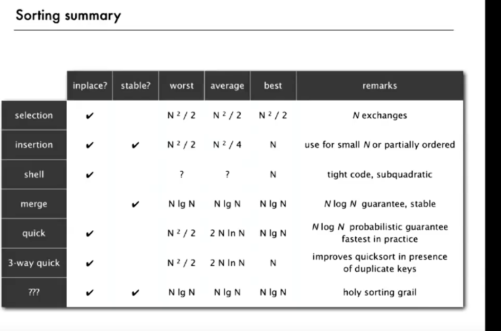
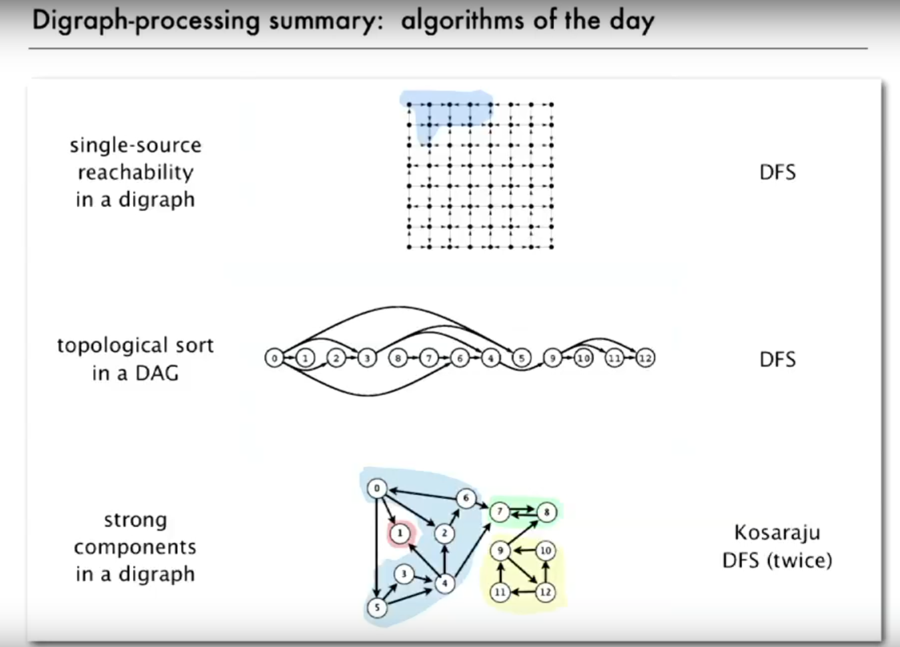
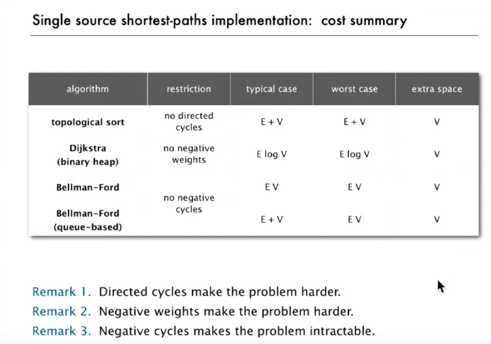
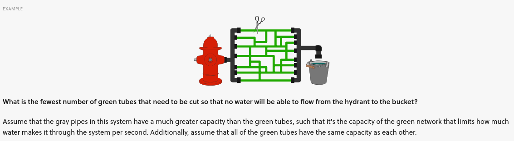

# Data Strutures and Algorithms
-  <a href="https://www.youtube.com/playlist?list=PLRdD1c6QbAqJn0606RlOR6T3yUqFWKwmX ">Video lectures from ROBERT SEDGWIG</a>

## Search

## Undiracted Graphs
- **DFS**: Go Deep down use recursion/stack to check adj node(s). 
- **BFS**: Queue each node and check the adj. Use df {edge (index), edgeTo[] (int), disTo[] (int)}
- **CC (connected components)**: Each cluster into 1 category. Each node in category is connected.

## Directed Graph
- **Strong Component**: digraph that have in and out. Similar to CC.
- **Kosaraju-Sharir**: (1) reverse graph and dfs -> return list of nodes list (2) Use node list to run dfs on og graph

## Minimum Spanning Tree (MST)
- Graph with weights -> find the lowest
- Kruskal's: sort weight lowest to highest, go down and add unless it create a cycle
- Prim's: Start at node #0, check node 1 step away, take the lowest using Priority Queue (PQ). 
  - Two version (1) Lazy and (2) Eager
- 
### Priority Queue
- Use binary heap as data structure  <a href="https://www.youtube.com/watch?v=AE5I0xACpZs">What is a Binary Heap?</a>

## Shortest Path
- Generic Shortest-path: check from 0-inf and relax any edge.
- <a href="https://youtu.be/_lHSawdgXpI?t=31">What is edge relaxation?</a> Initalize first node w/ 0 and everything else inf. Update/relax edge based on weights.
- <a href="https://youtu.be/_lHSawdgXpI">Dijkstra's algo (non-negative weights)</a>: similar start to Generic, keep track of total distance from root, update path if better weight found. check all nodes. <a href="https://youtu.be/uzHJXbToiIU?list=PLRdD1c6QbAqJn0606RlOR6T3yUqFWKwmX&t=127">demo</a>
- <a href="test">Topological Sort (no directed cycles)</a>: Find the lowest weight from the choosen node.<a href="https://youtu.be/Qp9zy9qMJzE?list=PLRdD1c6QbAqJn0606RlOR6T3yUqFWKwmX&t=42">demo</a>
- <a href="https://www.youtube.com/watch?v=obWXjtg0L64">Bellman-Ford (no negative cycle)</a>: Double relaxation w/ v-1 iteration <a href="https://youtu.be/A54rUI6CPSs?list=PLRdD1c6QbAqJn0606RlOR6T3yUqFWKwmX&t=406">demo</a>

### Application
- <a href="https://youtu.be/_lHSawdgXpI?t=31">Seam Carving</a>: non-linear scaling algorithm that determine the shortest path given the energy
- Parallel job scheduling problem

### Definition
- <a href="https://youtu.be/A54rUI6CPSs?list=PLRdD1c6QbAqJn0606RlOR6T3yUqFWKwmX&t=182">Negative Cycle</a>: Negative loop that traps shortest path algo
- <a href="https://www.youtube.com/watch?v=9PHkk0UavIM">Differences b/w Dijkstra vs Bellman-Ford</a>

## Maximum Flow
- <a href="https://www.youtube.com/watch?v=Tl90tNtKvxs">Ford-Fulkerson</a>:  

### Mincut Porblem
- Find the minimum capacity (capacity == weights)

#### Application
- Cold-war: Cut of railroad network of adversary at the cheapest cose
- Government-in-power: Cut of communication to a set of people

### Maxflow Problem
- Flow = weight w/ capacity. Water through a pipe. 
- Every node need to have a balance inflow & outflow

## Key-Indexed Counting
- count all element in list -> Create a cumulative sum of that count as index limits -> sort using that cumulative sum. 

## Radix LSD (Least Significant Digit) Sort
- Search from left to right using separate for loop. <a href="https://youtu.be/n7jfknr2Bxw?list=PLRdD1c6QbAqJn0606RlOR6T3yUqFWKwmX&t=191">Demo</a>

### MSD (Most Significant Digit)
- Start from right and recursively order each column. <a href="https://youtu.be/1XdrDjreqJM?list=PLRdD1c6QbAqJn0606RlOR6T3yUqFWKwmX&t=101">Demo</a>

## 3-ways String Quicksort
- <a href="https://youtu.be/QwzPkViilYA?list=PLRdD1c6QbAqJn0606RlOR6T3yUqFWKwmX&t=139">Demo</a> 

<a href="link">Demo</a>

